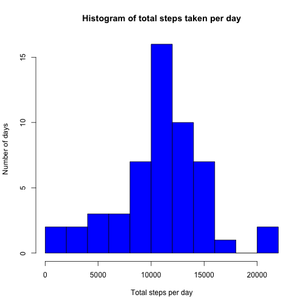
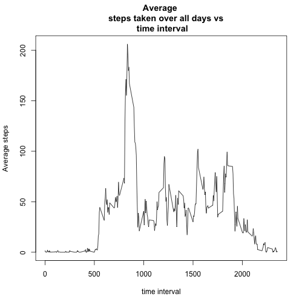
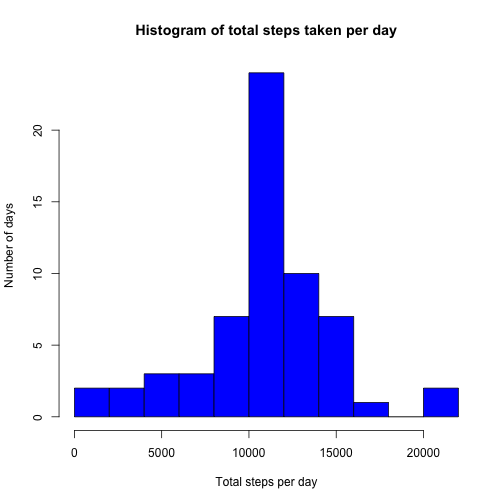
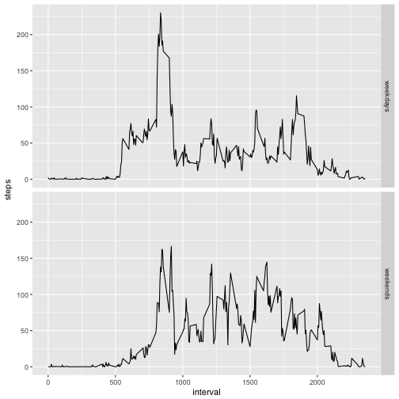

1. Loading the data
-------------------


```r
url <- "https://d396qusza40orc.cloudfront.net/repdata%2Fdata%2Factivity.zip"
file <- "data.zip"
download.file(url, file)
unzip(file)
activity <- read.csv("activity.csv", sep = ",")
```

The variable names and the structure of the file are given by

```r
names(activity)
```

```
## [1] "steps"    "date"     "interval"
```

```r
str(activity)
```

```
## 'data.frame':	17568 obs. of  3 variables:
##  $ steps   : int  NA NA NA NA NA NA NA NA NA NA ...
##  $ date    : Factor w/ 61 levels "2012-10-01","2012-10-02",..: 1 1 1 1 1 1 1 1 1 1 ...
##  $ interval: int  0 5 10 15 20 25 30 35 40 45 ...
```

```r
head(activity[which(!is.na(activity$steps)), ]) # data set with NA rows removed
```

```
##     steps       date interval
## 289     0 2012-10-02        0
## 290     0 2012-10-02        5
## 291     0 2012-10-02       10
## 292     0 2012-10-02       15
## 293     0 2012-10-02       20
## 294     0 2012-10-02       25
```

2. Mean total number of step taken per day
-------------------------------------------------------------


```r
library(reshape2)
activity_melt <- melt(activity[which(!is.na(activity$steps)), ], id.vars = c("date", "interval"))
steps_sum <- dcast(activity_melt, date ~ variable, sum)
```


```r
summary(steps_sum$steps)
```

```
##    Min. 1st Qu.  Median    Mean 3rd Qu.    Max. 
##      41    8841   10760   10770   13290   21190
```

Histogram of the total number of steps taken each day.

```r
hist(steps_sum$steps, main = "Histogram of total steps taken per day",
     xlab = "Total steps per day", ylab = "Number of days", 
     breaks = 10, col = "blue")
```



3. Average daily activity pattern
---------------------------------

A time series plot of the 5-minute interval and the average number of steps taken averaged across all days.


```r
stepsmeaninterval <- dcast(activity_melt, interval ~ variable, mean, na.rm = TRUE)
plot(stepsmeaninterval$interval, stepsmeaninterval$steps, ty = "l", 
     xlab = "time interval", ylab = "Average steps", main = "Average 
     steps taken over all days vs \n time interval")
```



The time interval during which the maximum number of steps is taken is


```r
maxsteps_interval <- stepsmeaninterval$interval[which.max(stepsmeaninterval$steps)]
maxsteps_interval
```

```
## [1] 835
```

4. Imputing missing values
--------------------------

We can replace the missing data for a day by the time average over all other days. 

```r
## Impute missing values
activity2 <- split(activity, activity$interval)
activity2 <- lapply(activity2, function(x) {
        x$steps[which(is.na(x$steps))] <- mean(x$steps, na.rm = TRUE)
        return(x)
})
activity2 <- do.call("rbind", activity2)
row.names(activity2) <- NULL

activity2 <- split(activity2, activity2$date)
df <- lapply(activity2, function(x) {
        x$steps[which(is.na(x$steps))] <- mean(x$steps, na.rm = TRUE)
        return(x)
})
activity2 <- do.call("rbind", activity2)
row.names(activity2) <- NULL
```


```r
library(reshape2)
activity_melt2 <- melt(activity2, id.vars = c("date", "interval"))
steps_sum <- dcast(activity_melt2, date ~ variable, sum, na.rm = TRUE)
```

Histogram of the total number of steps taken each day with the imputed missing values.


```r
hist(steps_sum$steps, main = "Histogram of total steps taken per day", 
     xlab = "Total steps per day", ylab = "Number of days", 
     breaks = 10, col = "blue")
```



Number of rows with NA values

```r
sum(is.na(activity$steps))
```

```
## [1] 2304
```

```r
sum(is.na(activity$steps))*100/nrow(activity) # Percentage of rows with missing values
```

```
## [1] 13.11475
```

5. Differences in activity patterns: Weekdays vs Weekends
---------------------------------------------------------

Create a new column describing if the date is a weekday or weekend.


```r
library(lubridate)
```

```
## 
## Attaching package: 'lubridate'
```

```
## The following object is masked from 'package:base':
## 
##     date
```

```r
weekends <- which(weekdays(as.Date(activity2$date)) == "Saturday" |
              weekdays(as.Date(activity2$date)) == "Sunday")
weekdays <- which(weekdays(as.Date(activity2$date)) != "Saturday" &
              weekdays(as.Date(activity2$date)) != "Sunday")
temp <- c(rep("a", length(activity2)))
temp[weekends] <- "weekend"
temp[weekdays] <- "weekday"
length(temp)
```

```
## [1] 17568
```

```r
names(temp) <- "day"
activity2 <- cbind(activity2, temp)
names(activity2)[4] <- "day"
```

Steps taken over each interval averaged across weekday days and weekend days.


```r
activity2split <- split(activity2, activity2$day)
stepsmean_interval <- lapply(activity2split, function(x) {
        temp <- aggregate(x$steps, list(x$interval), mean)
        names(temp) <- c("interval", "steps")
        return(temp)
})

## Unsplit stepsmean_interval
stepsmean_interval <- do.call("rbind", stepsmean_interval)
weekdays <- grep("weekday" ,row.names(stepsmean_interval))
weekends <- grep("weekend" ,row.names(stepsmean_interval))
temp <- c(rep("a", length(stepsmean_interval$steps)))
temp[weekdays] <- "weekdays"
temp[weekends] <- "weekends"
stepsmean_interval <- cbind(stepsmean_interval, temp)
row.names(stepsmean_interval) <- NULL
names(stepsmean_interval)[3] <- "day"


library(ggplot2)
ggplot(stepsmean_interval, aes(interval, steps)) + geom_line() + facet_grid(day ~ .) 
```



The mean number of steps taken over the weekdays and weekends.


```r
stepsdatamelt <- melt(stepsmean_interval, id.vars = c("interval",
                                                      "day"))
dcast(stepsdatamelt, day ~ variable, mean) # Average steps
```

```
##        day    steps
## 1 weekdays 35.61058
## 2 weekends 42.36640
```


